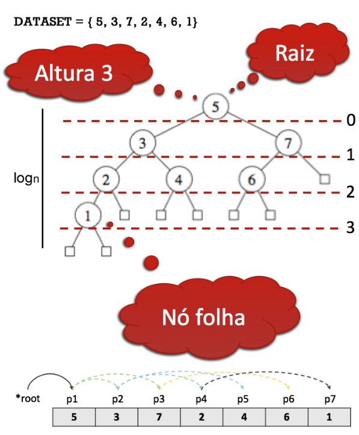

# Árvore Binária Básica

 
 
 
 

 

 

	Em uma árvore binária, cada elemento é denominado nó da árvore e sua posição na estrutura pode levar a uma de três nomenclaturas. Se o nó é o primeiro inserido, denominamos tal elemento como *raiz* da árvore. Partindo da *raiz*, temos por designação dois filhos, *filho esquerdo* e *filho direto*. Um filho é posicionado a esquerda, se somente se, seu valor de teste é menor que o valor do nó onde este será conectado. Este nó de conexão é conhecido como *nó pai*. Por conseguinte, os filhos tidos como direitos seguem a mesma regra, contudo, para valores maiores.

	Quando um nó não possui filhos, ou seja, seus ponteiros de filho esquerdo e direito estão livres ou com valores como *NULL*, chamados esse nó de folha e consideramos que este tipo de nó delimita o "fundo" da estrutura. A Fig. 1 detalha em alto nível esse modelo de estrutura de dados em detalhes.

 

A partir da Fig. 1 é possível observar algumas características importantes da estrutra em árvore. Primeiro, a estrutura detalha sua altura computando os *níveis* de hierarquia. No exemplo, é possível observar que, partindo do nó *raiz* (i.e., 5), temos como altura da árvore 3, considerando que a *raiz* se encontra em nível zero. Assim, identificar a altura de uma estrutura em árvore é equivalente a econtrar, partindo-se da *raiz*, o nó *folha* mais profundo existente. 

Observe na Fig. 1, que todo nó da estrutura apresenta no máximo dois filhos. Isso caracteriza a estrutura como binária, cujos nós são, no máximo, de grau 2. Consideramos como *grau* a quantidade de ponteiros conectados em um determinado nó. 

Por fim, ainda utilizando da representação da Fig. 1, podemos observar que é possível identificar a altura da estrutura. Em literatura, uma árvore binária *balanceada* apresenta como altura o fator de *log*n, com n representando o número de elementos inseridos. Esse *balanceamento* é obtido mantendo-se todas as *folhas* em níveis muito próximos, sendo aceitável uma variação de no máximo 1 de altura para variações. Consideramos esse contexto como caso médio, isso se considerarmos que as inserções são sempre realizadas a partir de valores aleatórios não ordenados. Caso contrário, se valores ordenados forem utilizados tem-se a possibilidade da altura ser linear em relação ao tamanho da entrada. Nesse último caso, a estrutura passará a apresentar ligações muito semelhantes a uma lista simplesmente encadeada e seus custos passam a acompanhar os já apresentados nesta estrutura. 

# Compilação e Execução

A estrutura árvore disponibilizada possui um arquivo Makefile que realiza todo o procedimento de compilação e execução. Para tanto, temos as seguintes diretrizes de execução:

| Comando                |  Função                                                                                           |                     
| -----------------------| ------------------------------------------------------------------------------------------------- |
|  `make clean`          | Apaga a última compilação realizada contida na pasta build                                        |
|  `make`                | Executa a compilação do programa utilizando o gcc, e o resultado vai para a pasta build           |
|  `make run`            | Executa o programa da pasta build após a realização da compilação                                 |

# Contatos

 

<a style="color:black" href="mailto:michel@cefetmg.br?subject=[GitHub]%20Source%20Dynamic%20Lists">
✉️ <i>michel@cefetmg.br</i>
</a>

